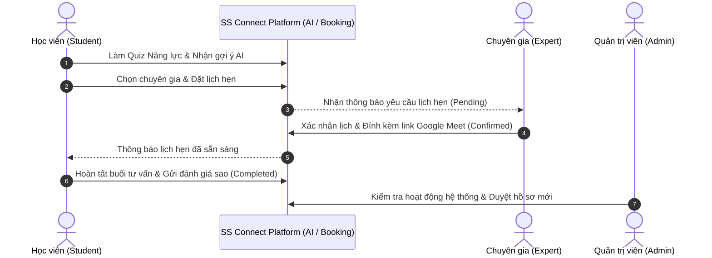

# KỊCH BẢN & HƯỚNG DẪN DEMO SẢN PHẨM SS CONNECT (STUDENT SUCCESS CONNECT)

> **Dự án:** Student Success Connect (SS Connect)  
> **Mục tiêu:** Nền tảng kết nối 1-1 giữa Học viên và Cố vấn / Chuyên gia thông qua AI Recommendation & Booking System  
> **Thời lượng đề xuất:** 7 - 10 phút (kèm 3 - 5 phút Q&A)

---

## 📌 MỤC LỤC
1. [Chuẩn Bị Trước Buổi Demo (Pre-demo Checklist)](#1-chuẩn-bị-trước-buổi-demo-pre-demo-checklist)
2. [Tài Khoản Demo Mẫu](#2-tài-khoản-demo-mẫu)
3. [Kịch Bản Chi Tiết Từng Bước (Live Demo Timeline)](#3-kịch-bản-chi-tiết-từng-bước-live-demo-timeline)
   - [Pha 1: Giới thiệu Tổng quan & Trang Chủ (1 Phút)](#pha-1-giới-thiệu-tổng-quan--trang-chủ-1-phút)
   - [Pha 2: Đăng Nhập & Bảo Mật OTP (1 Phút)](#pha-2-đăng-nhập--bảo-mật-otp-1-phút)
   - [Pha 3: Quiz Năng Lực & Gợi Ý AI (2 Phút)](#pha-3-quiz-năng-lực--gợi-ý-ai-2-phút)
   - [Pha 4: Đặt Lịch Tư Vấn Trực Tuyến (1.5 Phút)](#pha-4-đặt-lịch-tư-vấn-trực-tuyến-15-phút)
   - [Pha 5: Luồng Chuyên Gia - Phê Duyệt & Gửi Link Họp (1.5 Phút)](#pha-5-luồng-chuyên-gia---phê-duyệt--gửi-link-họp-15-phút)
   - [Pha 6: Đánh Giá & Phản Hồi Buổi Tư Vấn (1 Phút)](#pha-6-đánh-giá--phản-hồi-buổi-tư-vấn-1-phút)
   - [Pha 7: Luồng Quản Trị Viên (Admin Dashboard) (1 Phút)](#pha-7-luồng-quản-trị-viên-admin-dashboard-1-phút)
4. [Bí Quyết Pitching & Điểm Nhấn Kỹ Thuật (Tech Highlights)](#4-bí-quyết-pitching--điểm-nhấn-kỹ-thuật-tech-highlights)
5. [Kế Hoạch Dự Phòng Khi Gặp Sự Cố (Fallback Strategy)](#5-kế-hoạch-dự-phòng-khi-gặp-sự-cố-fallback-strategy)
6. [Bộ Câu Hỏi Phản Biện / Q&A Thường Gặp](#6-bộ-câu-hỏi-phản-biện--qa-thường-gặp)

---

## 1. CHUẨN BỊ TRƯỚC BUỔI DEMO (PRE-DEMO CHECKLIST)

### 1.1. Môi trường & Khởi động Dịch vụ
- [ ] **Backend Server:** Đã chạy `npm run dev` ở port `5000` (hoặc cổng BE quy định), kết nối cơ sở dữ liệu MongoDB thành công.
- [ ] **Frontend Client:** Đã chạy `npm run dev` ở port `5173` (hoặc cổng FE quy định).
- [ ] **Email Service / Mailtrap / Nodemailer:** Đảm bảo dịch vụ gửi OTP hoạt động mượt mà hoặc chuẩn bị sẵn mã OTP trong console / DB.
- [ ] **Dữ liệu giả lập (Seed Data):** Có sẵn tối thiểu 3 - 5 hồ sơ chuyên gia thuộc các lĩnh vực khác nhau (Lập trình Web, AI/Data, Định hướng nghề nghiệp, Du học).

### 1.2. Chuẩn bị Trình duyệt (Browser Tabs Setup)
Mở sẵn **2 cửa sổ trình duyệt riêng biệt** (hoặc 1 cửa sổ Thường + 1 cửa sổ Ẩn danh / 2 Profile khác nhau):
- **Cửa sổ 1 (Trình duyệt chính):** Đóng vai trò **Học viên (Student)** và **Quản trị viên (Admin)**.
- **Cửa sổ 2 (Ẩn danh / Profile phụ):** Đăng nhập sẵn tài khoản **Chuyên gia (Expert)** để minh họa tính phản hồi 2 chiều real-time khi duyệt lịch.
- **Tab dự phòng:** Mở sẵn `presentation.html` nếu cần thuyết trình slide trước khi vào thao tác thực tế.

---

## 2. TÀI KHOẢN DEMO MẪU

| Vai Trò | Email Mẫu | Mật Khẩu Mẫu | Mục Đích Demo |
| :--- | :--- | :--- | :--- |
| **Student** | `student.demo@ssconnect.vn` | `Student@123` | Thực hiện làm quiz, tìm chuyên gia qua AI, đặt lịch, chấm điểm review. |
| **Expert** | `expert.john@ssconnect.vn` | `Expert@123` | Nhận thông báo lịch mới, duyệt lịch `Confirmed`, thêm link Google Meet. |
| **Admin** | `admin@ssconnect.vn` | `Admin@123` | Quản trị người dùng, duyệt chuyên gia mới, xem báo cáo tổng thể. |

---

## 3. KỊCH BẢN CHI TIẾT TỪNG BƯỚC (LIVE DEMO TIMELINE)

---

### PHA 1: GIỚI THIỆU TỔNG QUAN & TRANG CHỦ (1 PHÚT)
- **Hành động trên màn hình:**
  1. Mở trang chủ `http://localhost:5173/`.
  2. Cuộn nhẹ qua Banner chính, các con số nổi bật, danh sách chuyên gia tiêu biểu và khối tính năng.
- **Lời thoại gợi ý (Script):**
  > *"Xin chào thầy cô/ban giám khảo và các bạn. Hôm nay em xin đại diện nhóm trình bày về **SS Connect — Student Success Connect**, nền tảng trực tuyến giúp học sinh, sinh viên kết nối 1-1 với các chuyên gia, mentor và cố vấn học tập hàng đầu.  
  > Vấn đề lớn nhất của học viên hiện nay là mất phương hướng và tốn nhiều thời gian khi tìm người hướng dẫn phù hợp. SS Connect giải quyết triệt để vấn đề này nhờ hệ thống trắc nghiệm đánh giá kết hợp **thuật toán AI Recommendation** và tính năng **đặt lịch thông minh**."*

---

### PHA 2: ĐĂNG NHẬP & BẢO MẬT OTP (1 PHÚT)
- **Hành động trên màn hình:**
  1. Nhấn **Đăng nhập** -> Nhập email học viên.
  2. Thao tác xác thực OTP hoặc giải thích cơ chế bảo mật xác thực 2 lớp qua Email.
- **Lời thoại gợi ý (Script):**
  > *"Hệ thống đảm bảo tính an toàn bảo mật cao với cơ chế phân quyền RBAC và xác thực danh tính qua OTP Email cùng chuẩn mã hoá JWT token."*

---

### PHA 3: QUIZ NĂNG LỰC & GỢI Ý AI (2 PHÚT) — 🔥 CORE FEATURE
- **Hành động trên màn hình:**
  1. Điều hướng vào trang **Trắc nghiệm / Quiz** (`/quiz`).
  2. Thao tác nhanh 3 - 5 câu hỏi khảo sát (chọn nhu cầu: Lập trình Backend, Cần định hướng nghề nghiệp, kỹ năng còn yếu).
  3. Bấm **Xem kết quả & Gợi ý chuyên gia**.
  4. Hệ thống hiển thị biểu đồ phân tích kỹ năng và danh sách **Top Chuyên Gia được AI gợi ý** tương thích nhất kèm % Match Score.
- **Lời thoại gợi ý (Script):**
  > *"Điểm khác biệt lớn của SS Connect là tính năng **Đánh giá Năng lực & Gợi ý AI**. Học viên không cần tự mò mẫm trong hàng trăm hồ sơ. Sau khi trả lời các câu hỏi về mục tiêu và kỹ năng hiện tại, hệ thống AI sẽ phân tích nhu cầu và tự động đưa ra danh sách Mentor phù hợp nhất cùng điểm tương thích (Match Score)."*

---

### PHA 4: ĐẶT LỊCH TƯ VẤN TRỰC TUYẾN (1.5 PHÚT)
- **Hành động trên màn hình:**
  1. Bấm vào hồ sơ chuyên gia được gợi ý (ví dụ: Chuyên gia John Doe).
  2. Xem Profile: Bằng cấp, kỹ năng, đánh giá từ học viên trước, các khung giờ rảnh (Availability).
  3. Bấm **Đặt lịch hẹn (Book Appointment)**:
     - Chọn ngày & Khung giờ mong muốn.
     - Nhập chủ đề cần tư vấn: *"Tư vấn lộ trình học Node.js & phỏng vấn intern"*.
     - Bấm **Xác nhận đặt lịch**.
  4. Chuyển sang trang **Lịch hẹn của tôi** (`/appointments`) -> Hiển thị trạng thái **`Pending` (Chờ duyệt)**.
- **Lời thoại gợi ý (Script):**
  > *"Chỉ với 3 bước đơn giản, học viên đã hoàn tất việc đặt lịch tư vấn mà không cần trao đổi thủ công qua lại. Lịch hẹn lúc này ở trạng thái `Pending` và chuyên gia sẽ lập tức nhận được thông báo tiếp nhận."*

---

### PHA 5: LUỒNG CHUYÊN GIA - PHÊ DUYỆT & GỬI LINK HỌP (1.5 PHÚT)
- **Hành động trên màn hình:**
  1. Chuyển sang **Cửa sổ 2 (Trình duyệt của Chuyên gia)**.
  2. Mở **Expert Dashboard** (`/expert/dashboard`).
  3. Thấy ngay yêu cầu đặt lịch mới từ Học viên vừa gửi.
  4. Bấm **Chấp nhận (Accept)** -> Nhập đường link phòng họp (Google Meet / Zoom: `https://meet.google.com/abc-defg-hij`).
  5. Quay lại Cửa sổ Học viên -> Refresh hoặc thấy trạng thái đã chuyển thành **`Confirmed` (Đã duyệt)** kèm nút **Tham gia cuộc họp (Join Meeting)**.
- **Lời thoại gợi ý (Script):**
  > *"Ở phía Chuyên gia, bảng điều khiển trực quan giúp quản trị toàn bộ thời gian biểu. Chuyên gia có thể duyệt lịch và gắn link họp trực tiếp. Trạng thái lập tức đồng bộ sang tài khoản học viên, sẵn sàng cho buổi cố vấn."*

---

### PHA 6: ĐÁNH GIÁ & PHẢN HỒI BUỔI TƯ VẤN (1 PHÚT)
- **Hành động trên màn hình:**
  1. Đổi trạng thái lịch hẹn sang **`Completed` (Hoàn thành)**.
  2. Tại giao diện Học viên, xuất hiện nút **Viết Đánh Giá (Leave Review)**.
  3. Chọn chấm 5 sao ⭐⭐⭐⭐⭐ và để lại bình luận: *"Mentor hướng dẫn cực kỳ tận tâm và giải đáp đúng trọng tâm thắc mắc!"*.
  4. Gửi đánh giá -> Điểm trung bình và số lượng review trên trang cá nhân của Chuyên gia được cập nhật ngay lập tức.
- **Lời thoại gợi ý (Script):**
  > *"Sau mỗi buổi tư vấn hoàn thành, học viên sẽ gửi đánh giá minh bạch. Điều này giúp nâng cao trách nhiệm của đội ngũ cố vấn và duy trì chất lượng cộng đồng ngày một uy tín."*

---

### PHA 7: LUỒNG QUẢN TRỊ VIÊN (ADMIN DASHBOARD) (1 PHÚT)
- **Hành động trên màn hình:**
  1. Đăng nhập tài khoản **Admin** -> Vào trang `/admin`.
  2. Trình diễn các chỉ số thống kê: Tổng số lượng học viên, số chuyên gia, tổng buổi tư vấn, biểu đồ phân bổ.
  3. Trình diễn tính năng **Phê duyệt hồ sơ Chuyên gia (Approve/Reject Expert Application)** để kiểm soát đầu vào.
- **Lời thoại gợi ý (Script):**
  > *"Cuối cùng là hệ thống Quản trị viên (Admin Portal) cho phép theo dõi toàn bộ sức khỏe nền tảng, quản lý người dùng và duyệt hồ sơ chuyên gia mới trước khi cho phép hoạt động công khai."*

---

## 4. BÍ QUYẾT PITCHING & ĐIỂM NHẤN KỸ THUẬT (TECH HIGHLIGHTS)

Khi thuyết trình với Giám khảo hoặc Khách hàng, hãy nhấn mạnh các từ khóa công nghệ đắt giá sau:

1. **Kiến trúc Hiện đại & Tối ưu:**
   - **Frontend:** React + Vite + TypeScript mang lại tốc độ tải trang dưới 1 giây, giao diện Responsive mượt mà với Dark/Light Mode.
   - **Backend:** Node.js, Express.js RESTful API, phân chia Controller - Service - Model chuẩn mực.
   - **Cơ sở dữ liệu:** MongoDB với Mongoose Schema tối ưu index cho truy vấn tìm kiếm nhanh chóng.
2. **Trải nghiệm người dùng mượt mà (Seamless UX):**
   - Đặt lịch tự động, ngăn chặn tình trạng Double-Booking (trùng slot).
   - Tích hợp thông báo qua Email & giao diện trạng thái trực quan.
3. **Khả năng mở rộng (Scalability):**
   - Dễ dàng tích hợp thêm WebRTC Video Call trực tiếp trong app, hệ sinh thái thanh toán (VNPAY/Momo) và mở rộng mô hình AI LLM chuyên sâu hơn.

---

## 5. KẾ HOẠCH DỰ PHÒNG KHI GẶP SỰ CỐ (FALLBACK STRATEGY)

| Tình huống rủi ro | Nguyên nhân tiềm ẩn | Phương án xử lý ngay tại buổi demo |
| :--- | :--- | :--- |
| **Không nhận được mã OTP Email** | Hết hạn ngạch dịch vụ mail, mạng chập chờn | 1. Mở console backend / database lấy mã OTP điền trực tiếp. 2. Chuyển sang dùng tài khoản đã kích hoạt sẵn trong bảng demo. |
| **API AI phản hồi chậm** | Mạng kết nối API bên ngoài lag | Bật chế độ mock recommendation dự phòng đã định nghĩa sẵn trong hệ thống. |
| **Lỗi mạng nội bộ / Localhost ngưng** | Quên khởi động server BE/FE | Giữ bình tĩnh, mở file `presentation.html` để thuyết trình các mockup & sơ đồ kiến trúc trong lúc đồng đội hỗ trợ bật lại server. |

---

## 6. BỘ CÂU HỎI PHẢN BIỆN / Q&A THƯỜNG GẶP

### ❓ Q1: Thuật toán AI gợi ý chuyên gia hoạt động như thế nào?
> **Trả lời mẫu:**  
> *"Hệ thống sử dụng cơ chế vector/keyword matching kết hợp phân tích đa chiều: Lĩnh vực học viên quan tâm, khoảng cách kỹ năng (skill gaps) từ bài trắc nghiệm, và đối chiếu với tags kỹ năng, số năm kinh nghiệm và rating của mentor trong cơ sở dữ liệu để sắp xếp độ tương thích từ cao xuống thấp."*

### ❓ Q2: Hệ thống xử lý thế nào nếu 2 học viên cùng đặt một khung giờ của 1 chuyên gia?
> **Trả lời mẫu:**  
> *"Tại tầng Backend, hệ thống kiểm tra tính khả dụng của Slot thời gian trước khi tạo bản ghi Booking. Khi một yêu cầu được gửi đi, slot đó sẽ được đánh dấu tạm thời hoặc khi chuyên gia bấm xác nhận (Confirmed), các yêu cầu trùng slot sẽ tự động được cảnh báo hoặc từ chối để tránh tình trạng Double-booking."*

### ❓ Q3: Định hướng phát triển tiếp theo của dự án là gì?
> **Trả lời mẫu:**  
> *"Nhóm dự kiến tích hợp thêm: 1) Phòng gọi Video Call WebRTC tích hợp bảng trắng tương tác trực tiếp; 2) Cổng thanh toán tự động theo phiên tư vấn; 3) Ứng dụng di động (React Native) để đẩy thông báo đẩy Realtime."*

---

*Tài liệu này được biên soạn chuẩn hóa phục vụ buổi báo cáo sản phẩm SS Connect.*
